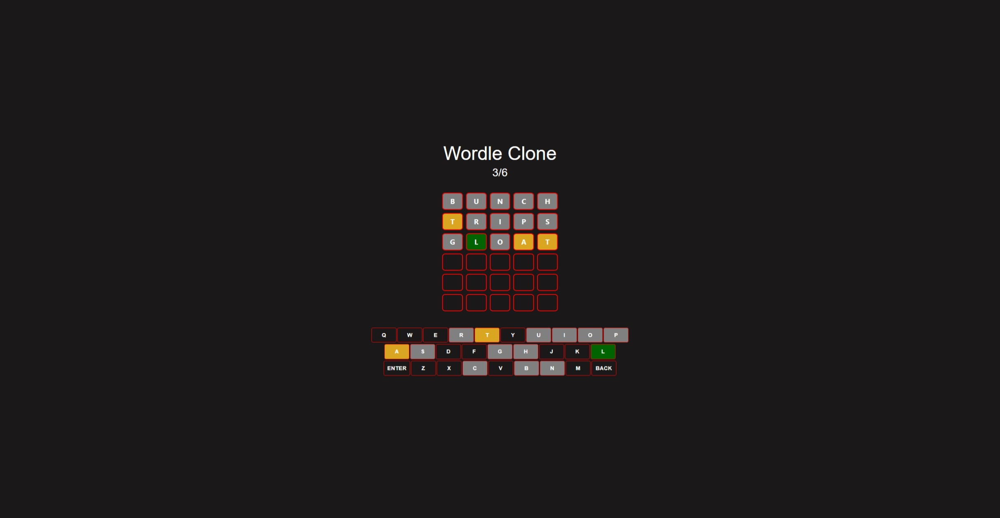

# Wordle Clone

## Table of contents

- [Overview](#overview)
  - [The challenge](#the-challenge)
  - [Screenshots](#screenshots)
  - [Links](#links)
- [My process](#my-process)
  - [Built with](#built-with)
  - [What I learned](#what-i-learned)
- [Author](#author)

## Overview

### The challenge

The goal of this project was to create a working clone of the Wordle game.

Users should be able to:

    - Enter input using the in-app keyboard
    - Enter input using a physical keyboard
    - See what letters are valid and which are invalid on the in-app keyboard
    - See which words they've guessed
    - See how many guesses you have made / how many you have left

### Screenshots

- App

### Links

- Live Site URL: [Wordle Clone](https://wordle-clone-proj.netlify.app/)

### Built With

- [React](https://reactjs.org/) - A JS front-end library
- [MUI](https://mui.com/) - Material UI styling library/framework for React
- Custom CSS properties

### What I learned

- How to create and use custom hooks

## Author

- Website - [Christopher Cox](https://chriscox12.github.io/)